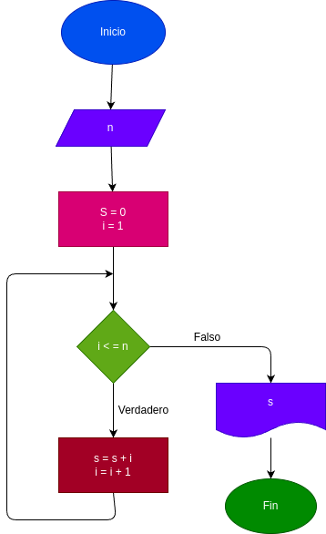

# While_1
Hallar la suma de los n numeros con while

# Analisis

# input

### Variables de entrada
n: numeros al que sea aplicar la formula.
### processing
s: valor inicial a la suma.

i: siguiente dijito a sumar.

mientras i <= n:

s = s + i

i + i = 1

### output
s
# Diseño

# Construccion